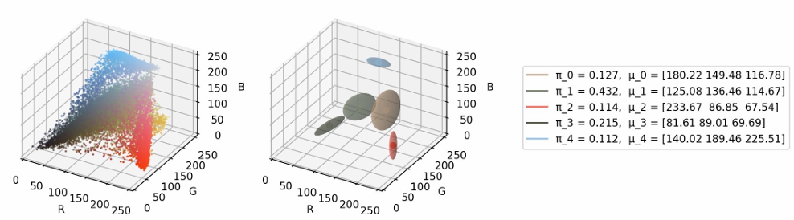
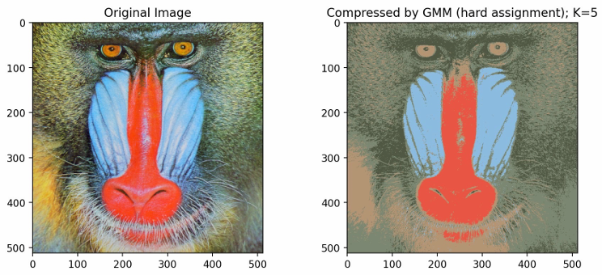
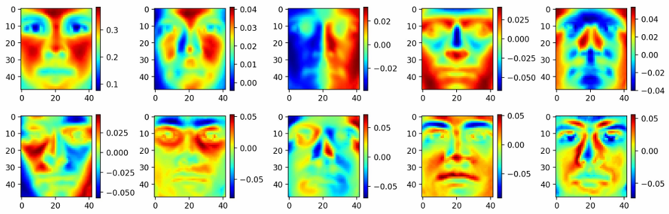
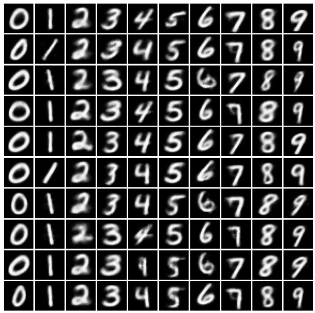

# Unsupervised Learning Toolkit: K-Means, GMM, CVAE & More

This repository showcases a collection of essential **unsupervised learning algorithms**, implemented using NumPy and PyTorch. Each method is applied to real-world tasks like **image compression**, **dimensionality reduction**, **source separation**, and **conditional image generation**.

---

## 📌 Overview

| Method | Description |
|--------|-------------|
| K-Means | Hard clustering used for image compression and color quantization. |
| GMM     | Soft probabilistic clustering using the Expectation-Maximization (EM) algorithm. |
| PCA     | Linear dimensionality reduction via eigen decomposition. |
| ICA     | Blind source separation based on statistical independence. |
| CVAE    | Conditional deep generative modeling using Variational Autoencoder architecture. |

---

## 1️⃣ K-Means Clustering

K-Means partitions input data (e.g. image pixeds) into `K` clusters by minimizing intra-cluster variance. It is widely used for **color quantization** and **image compression**.

### 📷 Result: K-Means Color Quantization



---

## 2️⃣ Gaussian Mixture Models (GMM)

GMM extends K-Means by modeling each cluster as a Gaussian distribution, learned via the EM algorithm. It performs **soft assignment**, assigning probabilities to each cluster.

### 📷 Result: GMM-Based Image Compression (K=5)



---

## 3️⃣ Principal Component Analysis (PCA)

PCA reduces dimensionality by projecting data onto the top eigenvectors of its covariance matrix. It's especially useful for visualizing high-dimensional datasets like **faces** or **gene expressions**.

### 📷 Result: PCA Eigenfaces Visualization



---

## 4️⃣ Independent Component Analysis (ICA)

ICA separates mixed signals into statistically independent components. Often used in **Audios signunmixes_track_ processing** or **blind source separation**, it differs from PCA by targeting independence rather than uncorrelatedness.

### 🎧 Recovered Audio Samples

Click the links below to download or listen to the separated audio signals:

- [🔊 Unmixed Audio 1](Audios/ica_unmixed_track_0.wav)
- [🔊 Unmixed Audio 2](Audios/ica_unmixed_track_1.wav)
- [🔊 Unmixed Audio 3](Audios/ica_unmixed_track_2.wav)
- [🔊 Unmixed Audio 4](Audios/ica_unmixed_track_3.wav)
- [🔊 Unmixed Audio 5](Audios/ica_unmixed_track_4.wav)

> 💡 Note: ICA recovers the signals up to permutation and scaling—so the order and amplitude may not match the true sources, but the content remains clearly separated.

---

## 5️⃣ Conditional Variational Autoencoder (CVAE)

CVAE is a deep generative model that allows you to generate samples **conditioned on a class label**. It is trained on the MNIST dataset to generate digits based on specific labels using the reparameterization trick.

### 📷 Result: CVAE Digit Generation (0–9 Grid)



---

## 📄 License

This repository is created for educational purposes (EECS 545 @ University of Michigan). Not licensed for commercial use.

---


## 🧪 Requirements

- Python ≥ 3.7
- NumPy
- SciPy
- scikit-learn
- PyTorch
- torchvision
- matplotlib
- Jupyter Notebook

To install the dependencies:

```bash
pip install -r requirements.txt
